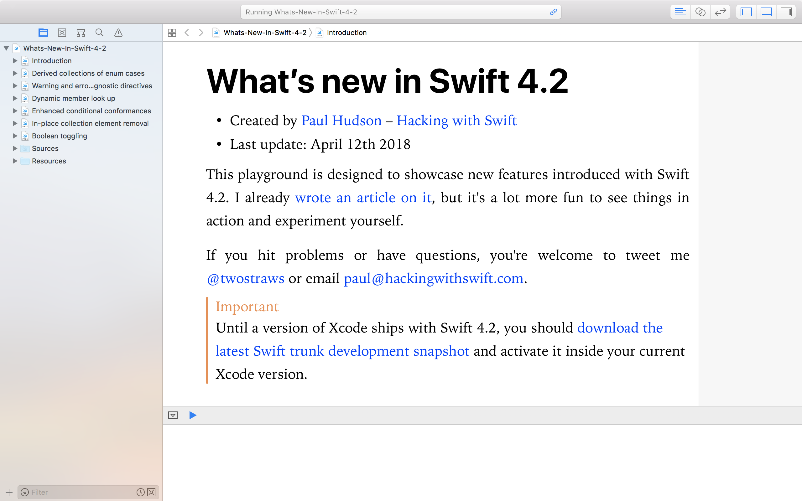

# What’s new in Swift 4.2?

This is an Xcode playground that demonstrates the new features introduced in Swift 4.2: 

* Derived collections of enum cases
* Warning and error diagnostic directives
* Dynamic member look up
* Enhanced conditional conformances
* In-place collection element removal
* Boolean toggling

This is designed to complement my existing article [What’s New in Swift 4.2?](https://www.hackingwithswift.com/articles/77/whats-new-in-swift-4-2)

If you hit problems or have questions, you're welcome to tweet me [@twostraws](https://twitter.com/twostraws) or email <paul@hackingwithswift.com>.

**Note:** Until a version of Xcode ships with Swift 4.2, you should [download the latest Swift trunk development snapshot](https://swift.org/blog/4-2-release-process/) and activate it inside your current Xcode version.

